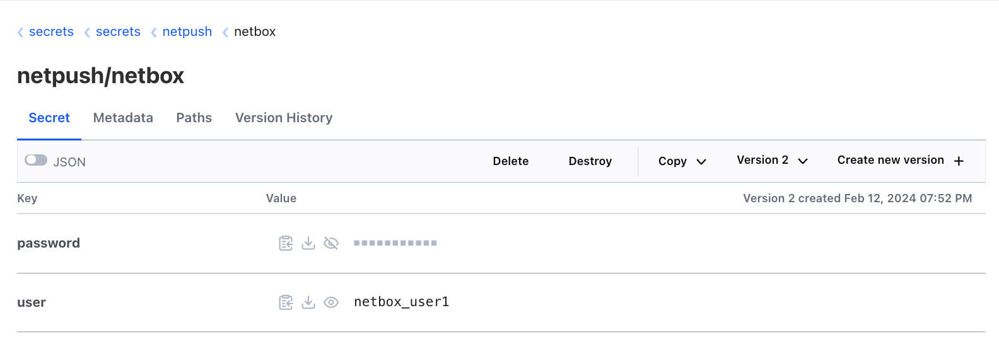
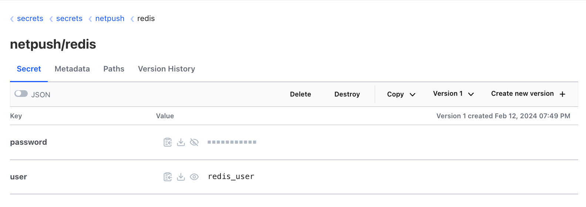

# Introduction
VaultSync is a Go library designed to simplify the synchronization of secrets from HashiCorp Vault to variables in a Go program. This guide provides an overview of how to use the VaultSync package and includes an example program to demonstrate its functionality.

# Getting Started
To begin using VaultSync, you need to import the package into your Go program:

```
import "github.com/pergus/vaultsync"
```

# Configuration
VaultSync requires a configuration file (config.hcl) to specify connection details and authentication settings for Vault. You can define the configuration parameters in the config.hcl file, including:

* Vault server URL
* Authentication method (e.g., approle, ldap, userpass)
* Username and password for authentication
* Renewal period for secrets

Here's an example configuration file (config.hcl):

```
config {
  server                = "http://localhost:8200"
  authmethod            = "approle"
  username              = "0ce25887-9a63-1c03-cd44-f7eccb684691"
  password              = "685a2a7f-e3ac-030c-ac7a-fdaa3d7f7251"
  renew_secrets_period  = 30
}
```

# Usage
To create a new VaultSync agent in your Go program, follow these steps:

Initialize a logger for logging messages (optional).
Specify any custom options for the agent, such as the configuration file path or log level.
Create a new VaultSync agent instance using the vaultsync.New() function.

```
logger := slog.New(slog.NewJSONHandler(file, loggerOpts))
vs, err := vaultsync.New(vaultsync.WithConfigFile("config.hcl"), vaultsync.WithLogLevel("info"), vaultsync.WithLogger(logger))
```

# Registering Secrets
Before syncing secrets, you need to define structs representing the secrets and implement the SecretReceiver interface. This interface includes the UpdateSecret() method, which updates the variables with the latest secrets from Vault.

Here's an example of defining a secret struct and implementing the SecretReceiver interface:

```
type netbox struct {
	mu       sync.Mutex
	id       string
	user     string
	password string
}

func (nb *netbox) UpdateSecret(id string, fieldName string, value interface{}) {
	// Implementation to update variables based on secret changes.
    // See example/main.go for sample implementation.
}
```

Once you've defined the secret structs, you can register them with the VaultSync agent using the RegisterUpdateSecret() method:

```
netbox := &netbox{id: "secrets/data/netpush/netbox"}
vs.RegisterUpdateSecret(netbox.id, netbox)
```
Note that the id is expecting the path to the vault secret.
A secret path is defined as:
```
<engine name>/data/<sub-paths>/<secret name>
```
So, in the example above the name of the engine is _secrets_, which is followed by /_data_/. The sub-paths is _netpush_ and _netbox_ is the name of the secret. 

# Running VaultSync
After registering the secrets, you can start the VaultSync agent by calling the Run() method. This method runs two background processes: one for renewing the authentication token and another for renewing the secrets periodically.

```
ctx, cancel := context.WithCancel(context.Background())
var wg sync.WaitGroup
vs.Run(ctx, &wg)
```
ctx: This is a context.Context object created using the context.WithCancel function. It represents the context for the execution of the program. Context provides a way to manage cancellation signals and deadlines across API boundaries and between multiple goroutines in your program.

cancel: This is a function returned by the context.WithCancel function. It can be called to cancel the context and any associated operations. When you call cancel(), it signals to the context and its children that they should abandon their work and clean up resources.

wg: This is a sync.WaitGroup object. It's used to synchronize the execution of multiple goroutines. WaitGroup allows you to wait for a collection of goroutines to finish their work before proceeding. You can use WaitGroup to wait until all the goroutines started by vs.Run() have completed their tasks.


# Example Program
The main.go in the example directory show you how a program imports the VaultSync package and demonstrates how to create a VaultSync agent, register secrets, and run the agent. It also includes a REPL (Read-Eval-Print Loop) for interacting with the program.

## Vault Secrets
To be able to runt the provided example program you have to create a KV Version 2 secrets engine in Hashicorp Vault named _secrets_. Then create the secrets _netpush/netbox_ and _netpush/redis_ that each has two keys _user_ and _password_ as shown below.

Netbox secret.


Redis secret.


## Vault authentication method
You have to create one or more authentication methods. At the moment the VaultSync package supports AppRole, LDAP and userpass as authentication methods. See the Hasicorp Vault offical documentation for details on how to create authentication methods.

## Configuration
Finally you have to edit the config.hcl file so that it reflects your specific Vault configuration.
```
config {
  server                = "http://localhost:8200"
  authmethod            = "userpass"
  username              = "go"
  password              = "secret"
  renew_secrets_period  = 30
}
```

## Retry and backoff periods
All functions that uses Vault secrets in your application should implement retry attempts with a backoff period.
In the context of vaultsync, it's recommended that the backoff period is longer than the renew_secrets_period since it 
determines how frequently secrets are renewed from Vault to ensure they are up-to-date. 

Setting the backoff period longer than the renew_secrets_period ensures that retry attempts do not interfere with the 
regular secret renewal process. It prevents potential contention or conflicts between retry attempts and periodic secret updates, improving the overall stability and reliability of your application.


